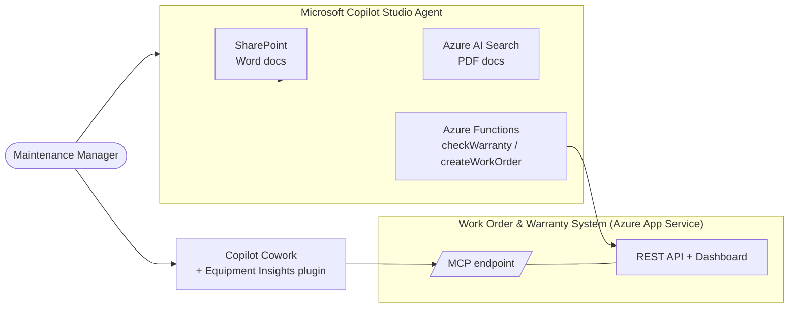

# AI Solution Accelerator — Demo Repository

This repository contains everything needed to deliver the **AI Solution Accelerator** demo: a 10‑minute story that shows how Microsoft takes a business requirement to a production‑ready AI solution using **Copilot Studio**, **Azure**, **Visual Studio Code**, **GitHub Copilot**, and **Copilot Cowork**.

**Scenario:** a maintenance manager at the fictitious **Contoso Electronics** (an electronics manufacturer) needs an AI assistant that can both *answer equipment questions* from enterprise knowledge and *take real actions* (check warranty, create work orders) — and turn that data into artifacts like a PowerPoint deck.

> Full narrative and goals: [docs/demo_proposal.md](docs/demo_proposal.md)

---

## What the demo shows

1. **Knowledge Q&A** — a Copilot Studio agent answers equipment questions grounded in documents hosted across **SharePoint** and **Azure AI Search**.
2. **AI‑assisted development** — GitHub Copilot generates **two Azure Functions** (`checkWarranty`, `createWorkOrder`) that call a live business system. *(This is the only piece built live during the presentation.)*
3. **Real business actions** — the agent uses the functions to check warranty and create work orders in the **Work Order & Warranty System**.
4. **Artifact generation** — **Copilot Cowork** generates a PowerPoint deck from the same live system data via a custom plugin.

## Architecture

---

## Repository structure

| Path | Description |
|------|-------------|
| [docs/](docs/) | All demo documentation (proposal, setup, run‑of‑show). |
| [artifacts/](artifacts/) | 15 equipment reference documents (7 Word + 8 PDF) used as agent knowledge, plus the generator script. |
| [workorder-system/](workorder-system/) | Node.js/Express **Work Order & Warranty System** — REST API, dashboard, MCP endpoint, and Bicep for Azure App Service. |
| [cowork-plugin/](cowork-plugin/) | **Copilot Cowork plugin** (manifest, skill, icons) that generates equipment decks from live system data. |

### Documentation index

| Document | Purpose |
|----------|---------|
| [docs/demo_proposal.md](docs/demo_proposal.md) | The demo story, flow, and key messages. |
| [docs/setup_guide.md](docs/setup_guide.md) | Step‑by‑step **environment setup to complete before the demo** (SharePoint, Azure AI Search, deploy the system, Copilot Studio agent, install the Cowork plugin). |
| [docs/demo_guide.md](docs/demo_guide.md) | The **presenter run‑of‑show**, the exact GitHub Copilot prompts and CLI commands for the live Azure Functions, sample questions, and the Cowork deck finale. |
| [workorder-system/README.md](workorder-system/README.md) | System API reference and deployment details. |
| [cowork-plugin/README.md](cowork-plugin/README.md) | Plugin build, packaging, and installation. |

---

## Prepared vs. built live

| Component | When |
|-----------|------|
| Equipment documents ([artifacts/](artifacts/)) | Prepared — upload to SharePoint / Azure AI Search during setup. |
| Work Order & Warranty System ([workorder-system/](workorder-system/)) | Prepared — deployed to Azure **before** the demo. |
| Copilot Studio agent + knowledge | Prepared — configured **before** the demo. |
| Copilot Cowork plugin ([cowork-plugin/](cowork-plugin/)) | Prepared — installed **before** the demo. |
| **Azure Functions** (`checkWarranty`, `createWorkOrder`) | **Built live** with GitHub Copilot, then connected to the agent. |

---

## Quick start

1. **Read** [docs/demo_proposal.md](docs/demo_proposal.md) to understand the story.
2. **Set up the environment** by following [docs/setup_guide.md](docs/setup_guide.md) end to end:
   - Host the Word docs on SharePoint and the PDFs on Azure AI Search (from [artifacts/](artifacts/)).
   - Deploy the [Work Order & Warranty System](workorder-system/) to Azure App Service.
   - Create and connect the Copilot Studio agent.
   - Build and install the [Copilot Cowork plugin](cowork-plugin/).
3. **Rehearse and present** using [docs/demo_guide.md](docs/demo_guide.md).

> Regenerate the equipment documents anytime with `python artifacts/generate_equipment_docs.py` (see the script to change the Word/PDF mix).

---

## Notes

- The Work Order & Warranty System is the **single source of truth** for warranty status and work orders — the Copilot Studio agent (via Azure Functions) and Copilot Cowork (via the MCP connector) both read the same data.
- Some equipment warranties are intentionally **expired** relative to the demo date, enabling the "expired → create work order" narrative.
- The samples use demo‑grade authentication (open endpoints). Harden authentication before any non‑demo use.
